# CYBR8470: Secure Web Application Development
Professor: Dr. Hale  
Student:   Robert Ernewein

## Lab 3: Docker Tutorial

### VM Setup

Platform: ASUS X555D  
Host OS: Windows 10 Home (Build 1903)  
No AMD-V/RVI support

Host VM: VMWare Workstation Pro (v15.5.0)  
Emulating AMD-V/RVI  
VM OS: Ubuntu 20 LTS

### Lab Prerequisites

Create AWS & Docker Hub Accounts
Clone repository: http://github.com/prakhar1989/docker-curriculum

### Install Docker-CE

Pull Busybox  

Busybox shell commands  

Docker run  

Remove containers  

### Static Sites

Pull Static-Site  

Static Published Locally  
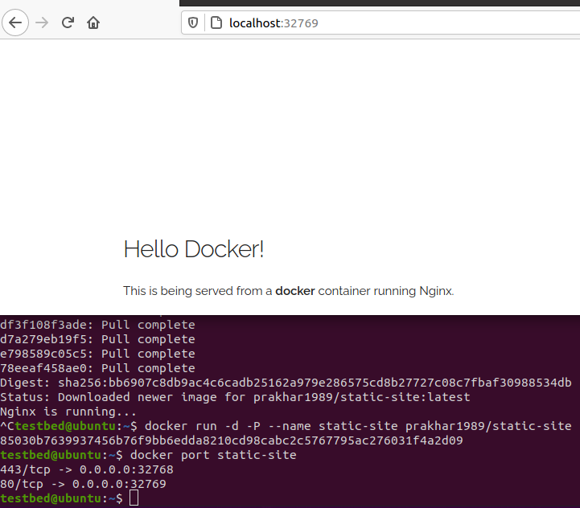

### Dockerfile

Python script  
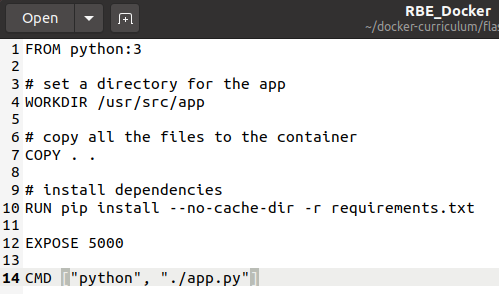

Docker build  
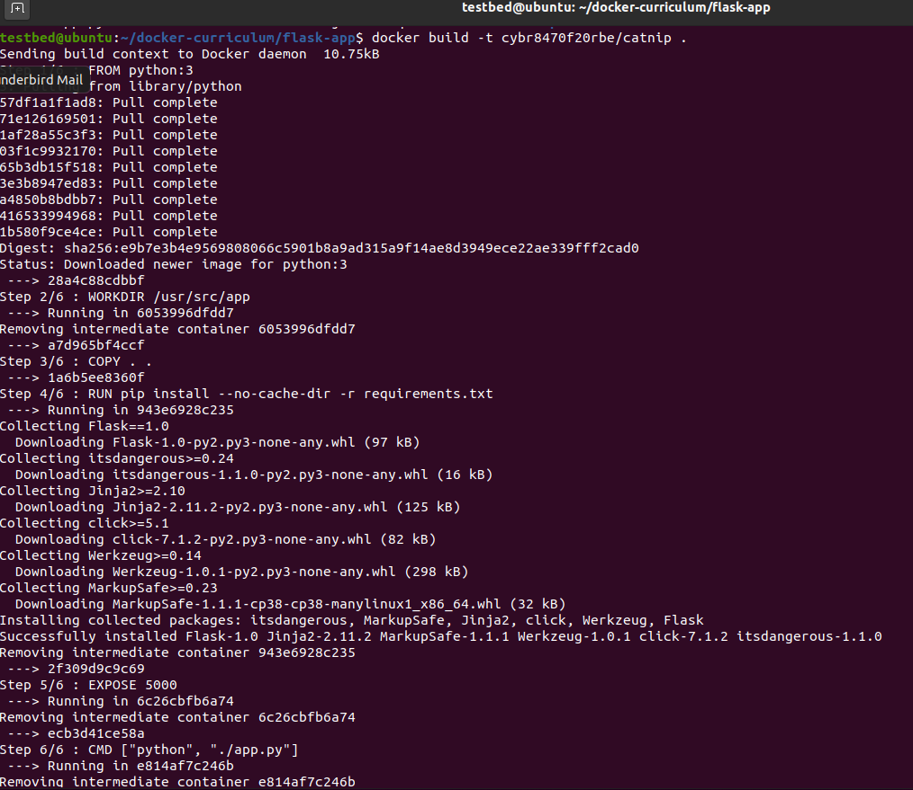

First build: Catnip  
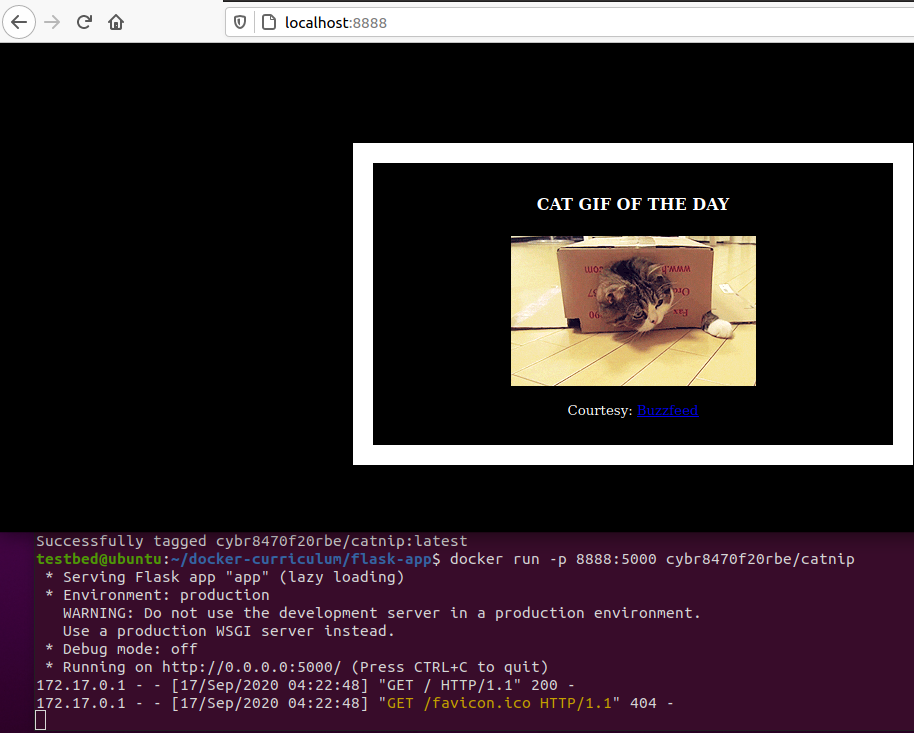

### AWS Beanstalk

Push to repository  
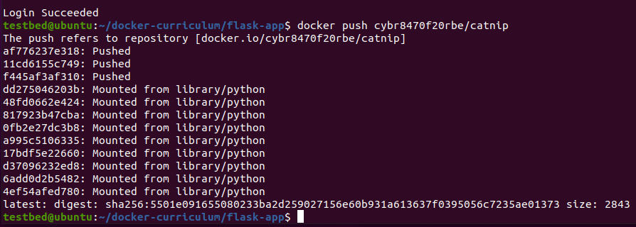

Published Beanstalk  
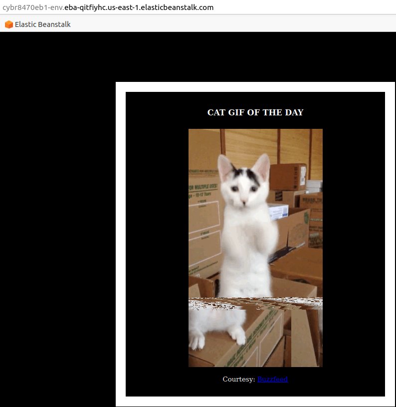

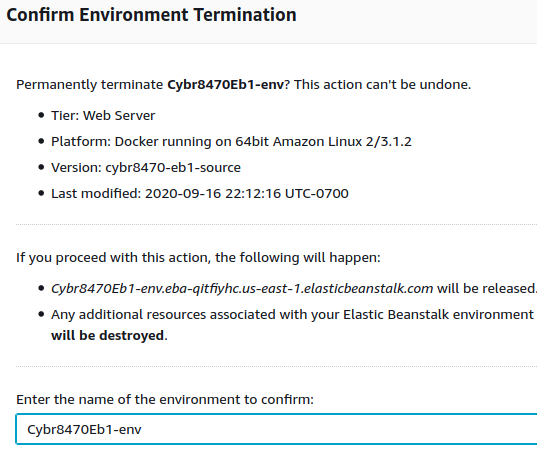

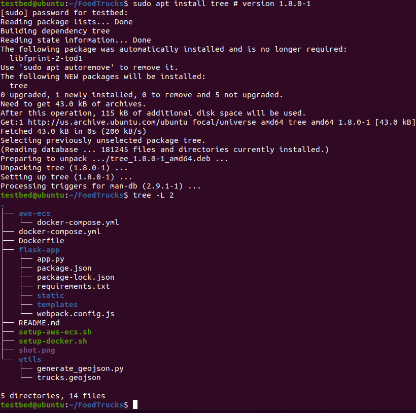

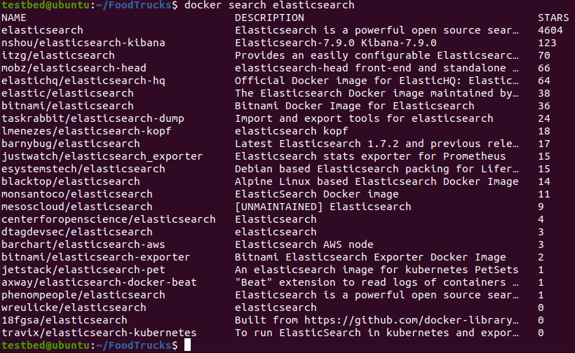

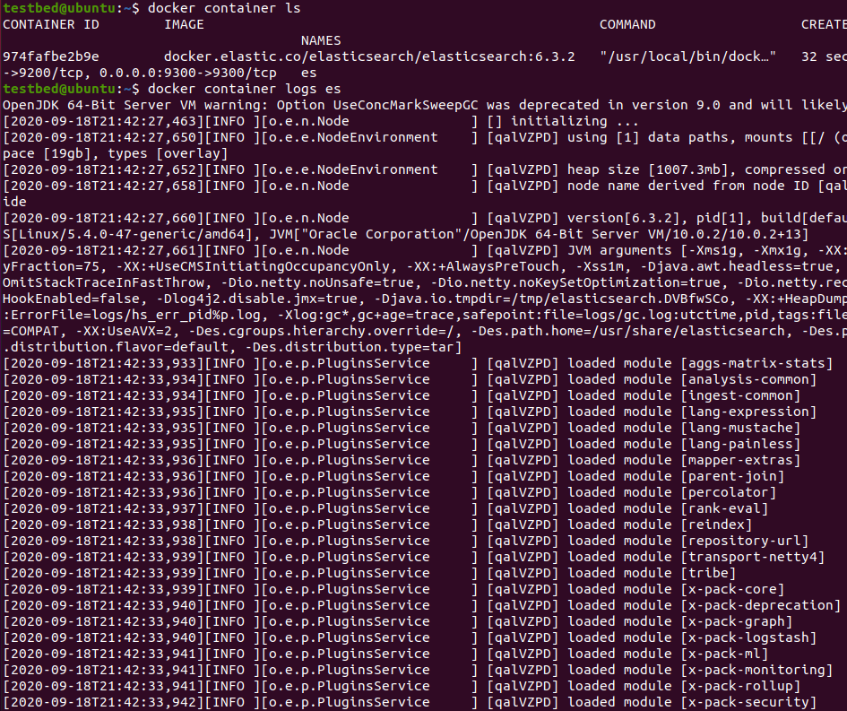

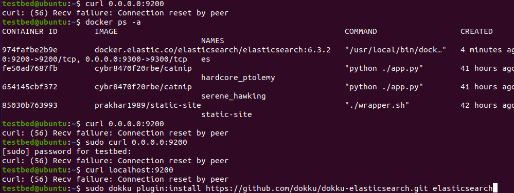

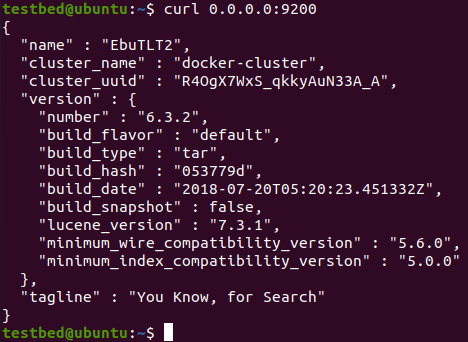

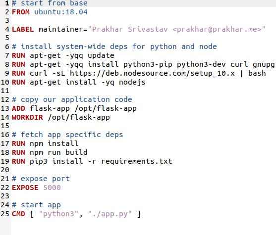

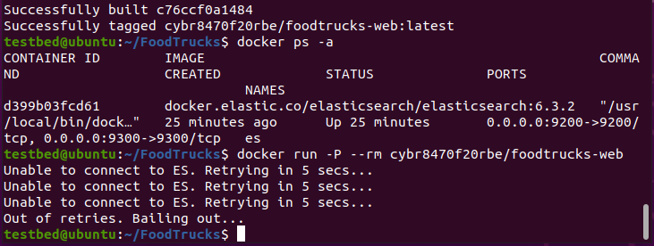

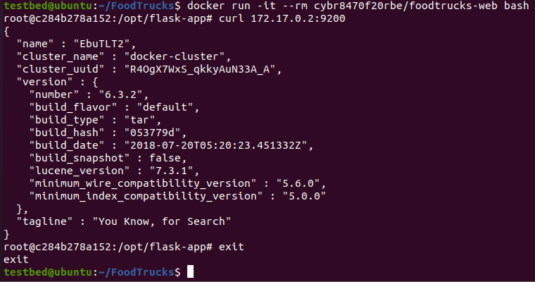

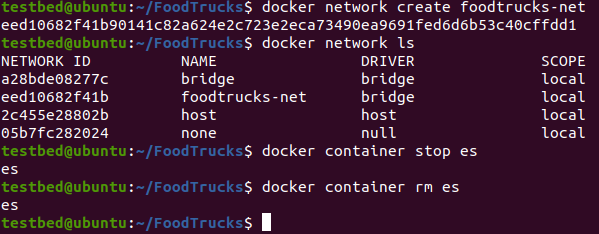

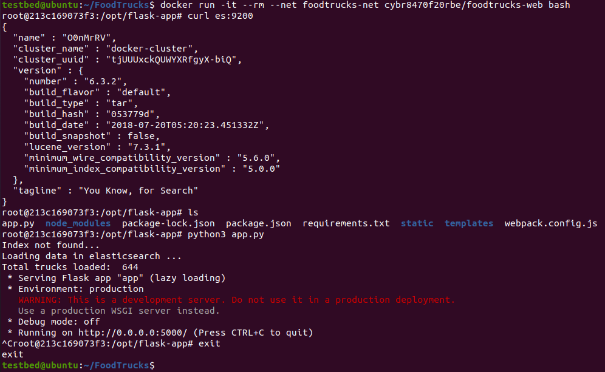

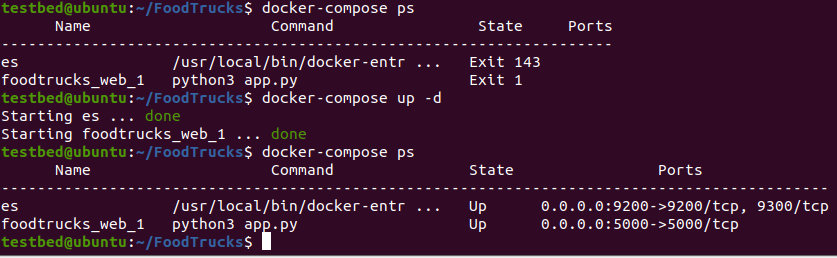

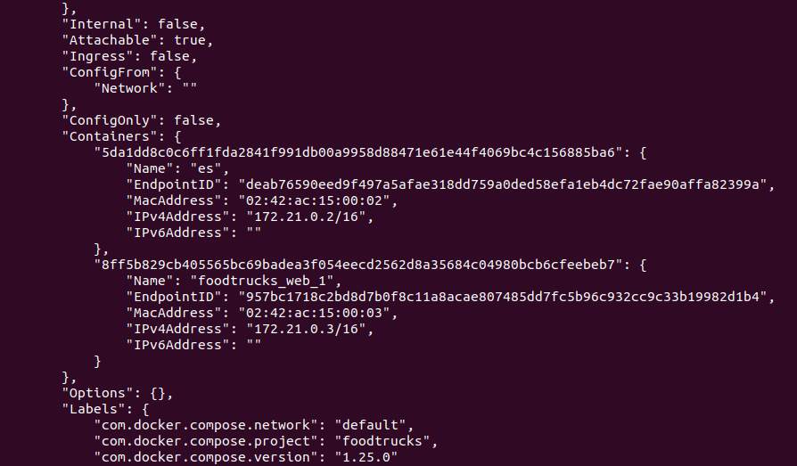

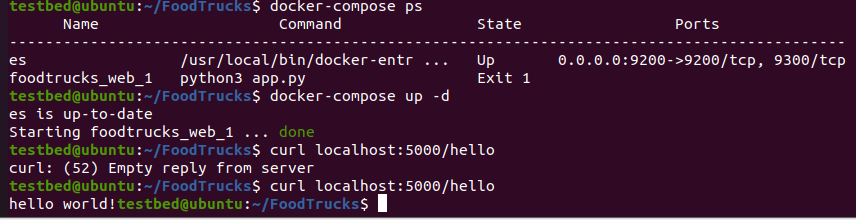

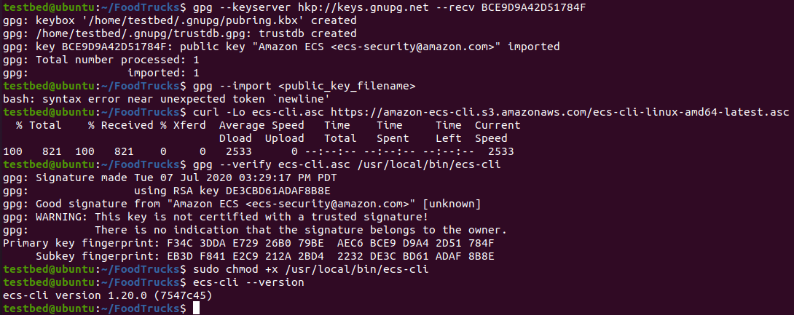

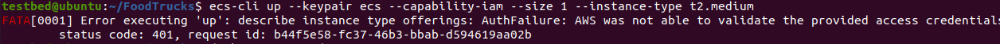

### AWS Elastic Container Service

I was unable to complete the final step. Permission issues with the guest account prevented key generation.

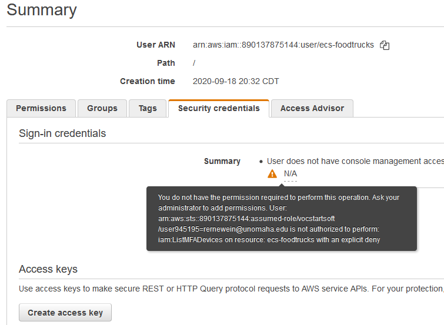

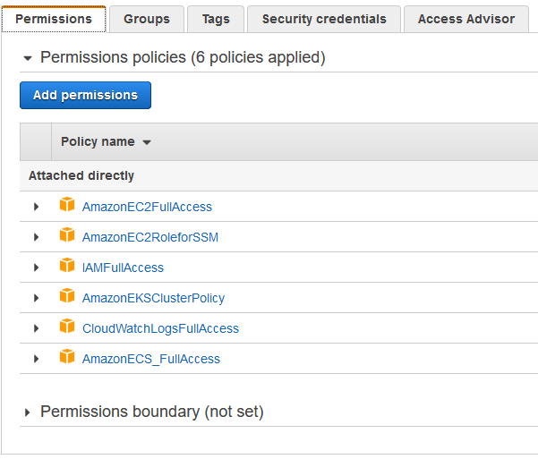

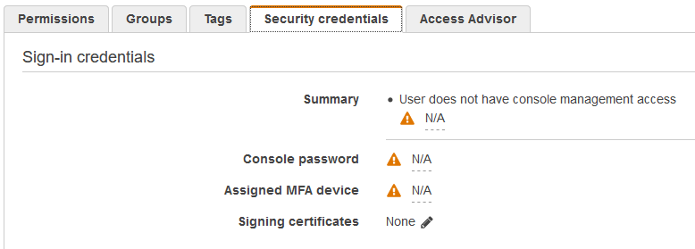